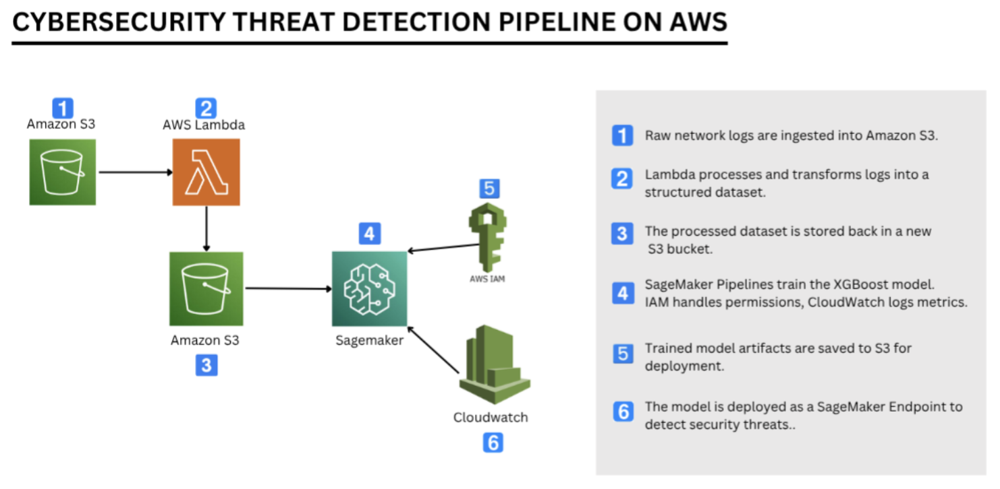
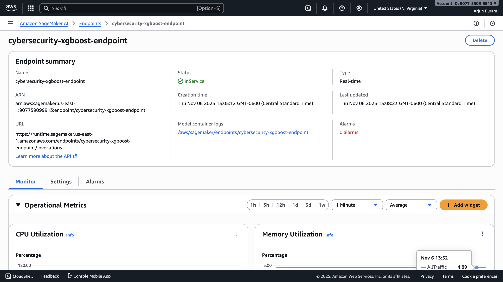
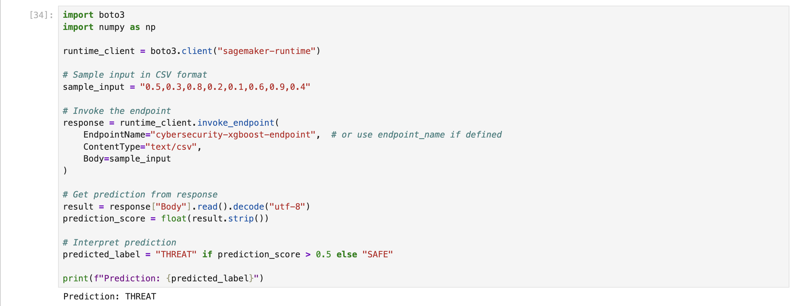
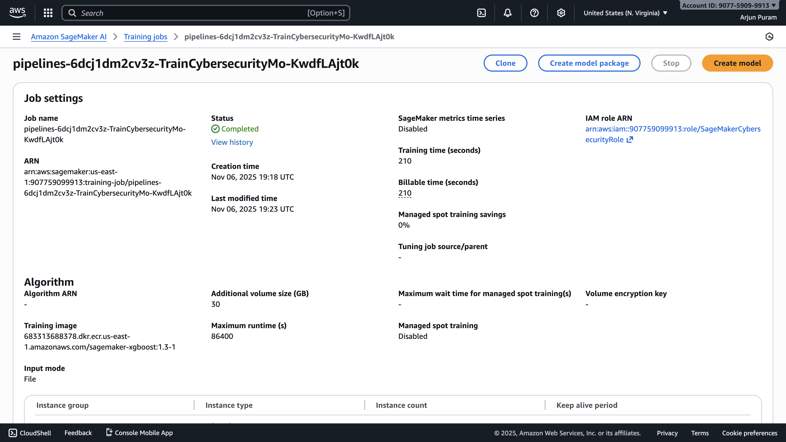
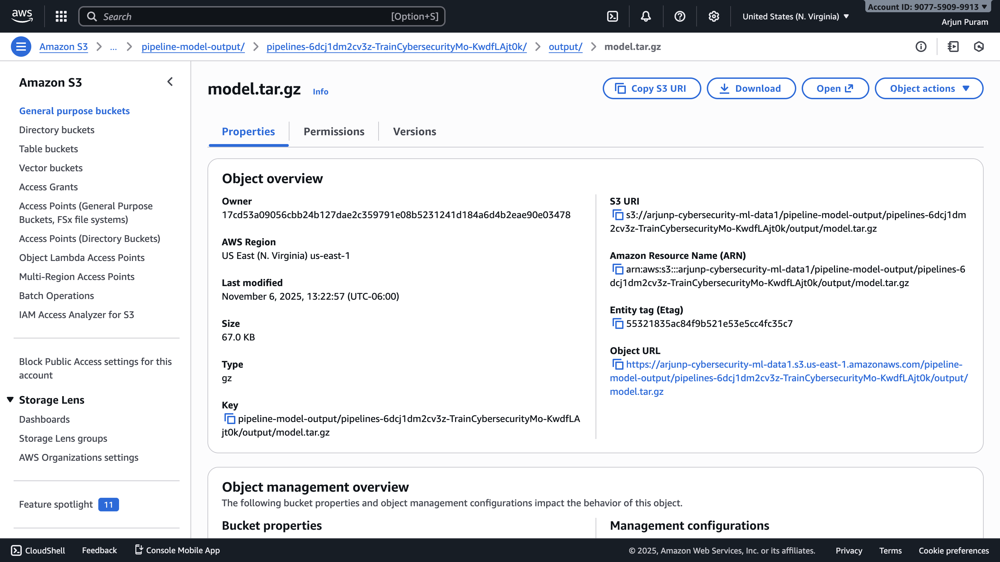
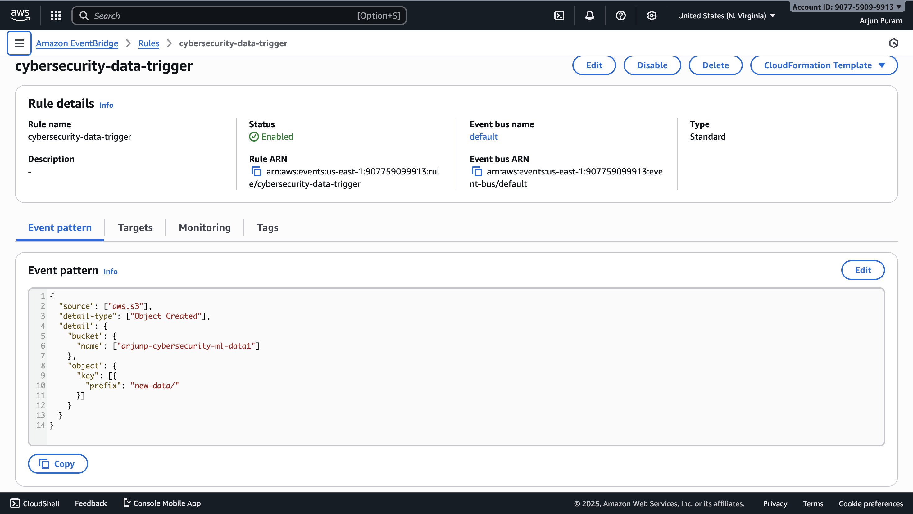

# 🛡️ Cybersecurity Threat Detection System using Amazon SageMaker

An end-to-end **machine learning pipeline** that detects cybersecurity threats from network traffic data using **Amazon SageMaker**.  
This project covers the entire lifecycle — from **data preprocessing** to **automated retraining** with **SageMaker Pipelines** and **EventBridge**.

---

## 🚀 Highlights
- Achieved **95%+ accuracy** using **XGBoost** on the UNSW-NB15 dataset  
- Fully automated **ML workflow** using SageMaker Pipelines  
- Real-time **threat detection endpoint** deployed on SageMaker  
- **EventBridge automation** for scheduled retraining  
- Clean, modular repo with Jupyter notebooks and result screenshots  

---
---

## 🧱 Architecture Diagram

The following diagram illustrates the end-to-end **Cybersecurity Threat Detection Pipeline** built on AWS:

**Workflow Summary:**
1. **Amazon S3** – Collects raw network logs.  
2. **AWS Lambda** – Processes and transforms logs into structured datasets.  
3. **Amazon S3** – Stores the processed dataset.  
4. **Amazon SageMaker** – Trains the XGBoost model using pipelines.  
5. **AWS IAM** – Manages access and permissions.  
6. **Amazon CloudWatch** – Logs metrics and monitors endpoint activity.  
7. **SageMaker Endpoint** – Deployed model for real-time threat detection.  

---
---

## ⚙️ Project Phases

This project was developed in **four main phases**, following a complete ML lifecycle using **Amazon SageMaker**.

---

### 🧹 Phase 1 — Data Preprocessing
**Notebook:** `notebooks/data_preprocessing.ipynb`

- Loaded the **UNSW-NB15 dataset** from S3.
- Cleaned missing data and removed unnecessary columns.
- Encoded categorical variables and normalized numerical features.
- Saved processed dataset back to S3 for training.

---

### 🧠 Phase 2 — Model Training and Evaluation
**Notebook:** `notebooks/02modeltraining_and_evaluation.ipynb`

- Trained an **XGBoost binary classification model** using SageMaker.
- Optimized hyperparameters for best accuracy and F1-score.
- Evaluated model performance on a test dataset.

**Results:**
| Metric | Value |
|--------|--------|
| Accuracy | 95.6% |
| Precision | 0.96 |
| Recall | 0.98 |
| F1-Score | 0.97 |

**Model Output (S3):**
**Screenshots:**
| Screenshot | Description |
|-------------|-------------|
|  | SageMaker XGBoost training job successfully completed |
|  | Model evaluation and prediction output from notebook |

---

### 🚀 Phase 3 — Model Deployment
**Notebook:** `notebooks/03model_deployment.ipynb`

- Registered the trained **XGBoost model** as a SageMaker Model.  
- Created a **SageMaker Endpoint** to enable real-time inference.  
- Tested the endpoint with sample input data to verify predictions.  
- Integrated CloudWatch to monitor endpoint performance.  

**Deployment Details:**
- **Model Name:** `cybersecurity-threat-xgboost`
- **Endpoint Name:** `cybersecurity-xgboost-endpoint`
- **IAM Role:** `arn:aws:iam::907759099913:role/SageMakerCybersecurityRole`

---

### 🔄 Phase 4 — Automation with SageMaker Pipelines & EventBridge
**Notebook:** `notebooks/04automation_pipeline.ipynb`

- Built an **automated ML workflow** using **Amazon SageMaker Pipelines**.  
- Defined a pipeline that automatically trains and stores the model artifacts in S3.  
- Configured **AWS EventBridge** to trigger retraining automatically when new data is uploaded to the S3 bucket.  
- Ensured full pipeline execution from data input → model retraining → output storage.

**Pipeline Configuration:**
- **Pipeline Name:** `simple-cybersecurity-pipeline`
- **Training Step:** `TrainCybersecurityModel`
- **Instance Type:** `ml.m5.large`
- 
**Screenshots:**
| Screenshot | Description |
|-------------|-------------|
|  | SageMaker pipeline execution showing status **Completed** |
|  | S3 bucket containing generated pipeline output model artifacts |
|  | AWS EventBridge rule configured to trigger automatic model retraining |

---

✅ **Summary:**
This phase successfully automated the **entire ML lifecycle** — from data ingestion and model retraining to deployment triggers — using **SageMaker Pipelines** and **EventBridge**.  
The system can now **auto-train and deploy** models whenever new network data is ingested.

---
